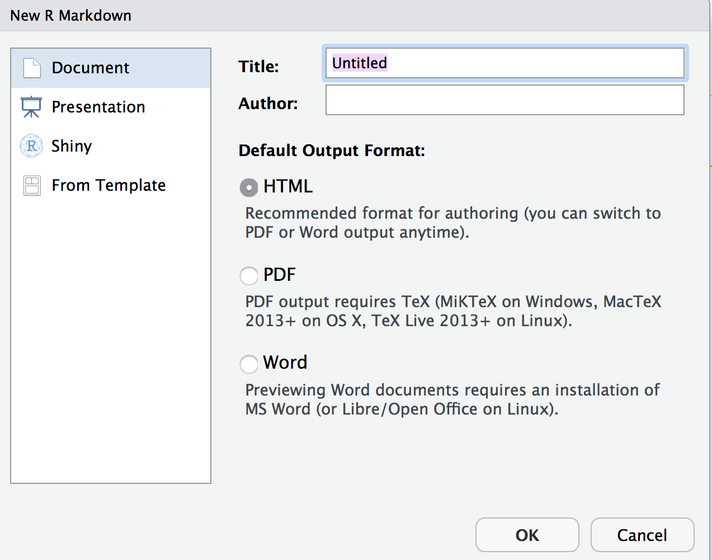
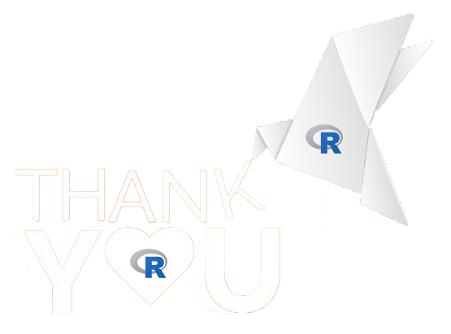

exclude: true
<style type="text/css">
code.r{
  font-size: 16px;
}
pre {
  font-size: 16px !important;
}
body {
text-align: justify}
</style>
---
class: split-two
<link rel="stylesheet" href="https://cdnjs.cloudflare.com/ajax/libs/font-awesome/4.7.0/css/font-awesome.min.css">
.column.bg-main1[
.font3[Introducción a R Markdown]
</br></br></br></br>
.font3[Eduardo Guamán]
.font_large[Reporte Interactivo</br>
`r Sys.Date()`]
</br>
.font_large[
<ul class="fa-ul">
				<li><i class="fa-li fa fa-envelope" id="icon"></i><a href="mailto:guamandseduardo@gmail.com" target="_blank">guamandseduardo@gmail.com</a></li>
				<li><i class="fa-li fa fa-linkedin-square" id="icon"></i><a href="https://www.linkedin.com/in/guamandseduardo/" target="_blank">linkedin.com/in/guamandseduardo</a></li>
        <li><i class="fa-li fa fa-github" id="icon"></i><a href="https://github.com/guamandseduardo" target="_blank">github.com/guamandseduardo</a></li>
        <li><i class="fa-li fa fa-twitter" id="icon"></i><a href="http://twitter.com/guamandseduardo" target="_blank">@guamandseduardo</a></li>
			</ul>
]
]
.column.bg-main3.center[
</br></br></br></br></br>

]
---
class: bg-main1 split-two
.column[
</br>
##[__R Markdown__](https://rmarkdown.rstudio.com/) es un formato que permite una fácil creación de documentos, presentaciones dinámicas e informes de R.
</br></br></br>
##__R Markdown__ admite docenas de formatos de salida estáticos y dinámicos, incluidos HTML, PDF, MS Word, Beamer, diapositivas HTML5, Tufte-style handouts, libros, dashboards, aplicaciones shiny, artículos científicos, sitios web, y otros.
]
.column[

]

---
class: bg-main1
# Instalar R Markdown

### - Instalar el paquete en RStudio

```{r, eval = FALSE, echo = TRUE}
install.packages("rmarkdown")
```

### - Activar el paquete instalado

```{r, eval = FALSE, echo = TRUE}
library(rmarkdown)
```

---

class: bg-main1 split-two
.column[
###Para comenzar a utilizar R Markdown, simplemente siga los siguientes pasos:

### 1. `File/New File/R Markdown...`.

### 2. Colocar un título y un nombre de autor.

### 3. Elegir entre los varios tipos de formatos, algunos de los cuales serán de su interés a medida que se acostumbre a usar R Markdown.

### 4. Guardar el archivo .orange[**.Rmd**] en alguna carpeta o proyecto.

### 5. Seleccionar la opción .orange[**knit**] y se generará la salida que eligió.
]
.column[

]

---
class: bg-main1
# DOCUMENTO ESTÁNDAR

* Encabezados
  + `#`, encabezado de nivel 1
  + `##`, encabezado de nivel 2
  + `###`, encabezado de nivel 3
  
* Cursiva, Negrita y Ambos
  - `*cursivo* y _cursivo_`, *cursivo* y _cursivo_
  - `**negrita** y __negrita__`, **negrita** y __negrita__
  - `***cursivanegrita*** y ___cursivanegrita___`, ***cursivanegrita*** y ___cursivanegrita___

* Listas
  + Para listas sin orden, usar `*` o `-` para el primer nivel. Para el nivel 2, usar `<tab> +`.
  + Para listas con orden, usar los números seguidos de un punto `1.`, `2.`, ...

* Insertar Imágenes
  + imagen: ``
  
* Insertar hiperlinks
  + `[Etiqueta](Link)`

---
class: bg-main1 split-two
.column[
#Incluir código
<br>

###Usa la sintaxis de ___knitr___ para incluir código R en tu informe. R correrá el código e incluirá los resultados cuando genere el documento.

### - Pedazos de código
####Comienza un trozo (chunk) con comillas triples{r} y termina un trozo con comillas triples, para insertar puede usar: el atajo Cmd/Ctrl + Alt + I, botón Insert -> R o manualmente. Los chunks pueden tener nombres.

### - Código incrustado
####Código dentro del texto, usar comillas simple con una r
]
.column[
#Opciones para mostrar (chunk)
<br>

- `eval = TRUE`, Indica si se va a evaluar el código e incluir los resultados.

- `echo = TRUE`, Indica si se muestra el código a la par de los resultados.

- `message = FALSE`, evita mostrar mensajes en el documento final.

- `warning = TRUE`, Indica si se muestran advertencias.

- `error = TRUE`, Indica si se muestran errores.

- Para mas detalles mira en [yihui.name/knitr/](https://yihui.name/knitr/)
]

---
class: bg-main1

###Tabla predeterminado

Hay varios paquetes disponibles para hacer que sus resultados R se vean mejor. Aquí está un data.frame predeterminado:

```{r}
head(mtcars)
```

###Tabla simple (con kable)

Se puede comenzar con kable de Knitr para crear tablas simples que se vean mucho mejor:

```{r}

knitr::kable(head(mtcars), format = "html", caption = "Muestra de mtcars")

```

---

## Tablas con KableExtra

Se puede usar kableExtra para hacer algunas cosas más divertidas y elegantes.

```{r, echo = TRUE, eval = FALSE}

library(tidyverse)
library(kableExtra)
mtcars %>%
  slice(1:10) %>% 
  arrange(mpg) %>% 
  round(2) %>% 
  mutate(mpg = factor(mpg)) %>% 
  mutate_if(is.numeric, function(x) {
    cell_spec(x, bold = T, 
              color = spec_color(x, end = 0.9, option = 'plasma', direction = -1),
              font_size = spec_font_size(x))
  }) %>%
  mutate(mpg = cell_spec(
    mpg, color = 'white', bold = T,
    background = spec_color(1:10, end = 0.9, option = 'viridis', direction = -1)
  )) %>%
  kable(format='html', escape = F, align = 'c') %>%
  kable_styling(c('condensed', 'basic'), full_width = F, position='left')

```

La salida de la tabla se muestra en la siguiente diapositiva...

---


## Tablas con KableExtra

<center>

```{r, echo = FALSE, eval = TRUE, warning = FALSE, message = FALSE}

library(tidyverse)
library(kableExtra)
mtcars %>%
  slice(1:10) %>% 
  arrange(mpg) %>% 
  round(2) %>% 
  mutate(mpg = factor(mpg)) %>% 
  mutate_if(is.numeric, function(x) {
    cell_spec(x, bold = T, 
              color = spec_color(x, end = 0.9, option = 'plasma', direction = -1),
              font_size = spec_font_size(x))
  }) %>%
  mutate(mpg = cell_spec(
    mpg, color = 'white', bold = T,
    background = spec_color(1:10, end = 0.9, option = 'viridis', direction = -1)
  )) %>%
  kable(format='html', escape = F, align = 'c') %>%
  kable_styling(c('condensed', 'basic'), full_width = F, position='left')

```

</center>

---

## Tabla con DT

Para mayor interactividad y más opciones para jugar, considere el paquete `DT`.

```{r con el paquete DT}

DT::datatable(mtcars, 
              extensions = 'ColReorder', 
              options = list(colReorder = TRUE, 
                             pageLength = 5))

```

---
class: bg-main1

# Gráfico de barras con ggplot2 y plotly
<center>

```{r datamtcars, fig.height=8, warning=FALSE, echo=FALSE, message = FALSE, fig.align='center', fig.width=10}

# Gráfico con ggplot2
gbar <- ggplot2::ggplot(mtcars, aes(cyl, ..prop.., group = 1)) +
  geom_bar()
# Gráfico Interactivo
library(plotly)
ggplotly(gbar)

```

</center>

---

class: bg-main1

.center.white[
# Gracias!
]

</br>
.center[]
</br></br>

.corner-box.top-center[Contacto: @guamandseduardo o guamandseduardo@gmail.com]


